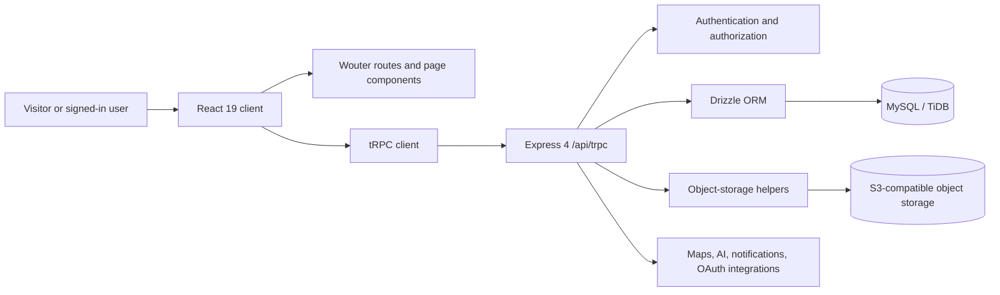

# Nyumba 360 Project Guide

**Product:** Nyumba 360  
**Audience:** Product owners, administrators, agents, sellers, support staff, and developers  
**Last updated:** 24 August 2026  
**Current documented release:** Interactive About-page team section (`257081ad`)

> **Purpose.** Nyumba 360 is a Kenyan property marketplace and operating workspace. It helps people discover approved properties, sellers manage listings, agents manage leads, owners manage operations, tenants access explicitly assigned records, and administrators moderate the platform.

This guide describes the application as it is currently implemented. It separates **live capabilities** from work that is intentionally deferred, especially live M-Pesa payment processing. It should be updated whenever a material route, data model, integration, authorization rule, or user workflow changes.

## 1. Product overview

Nyumba 360 is a responsive marketplace for residential, land, and commercial property journeys in Kenya. Its public experience focuses on property discovery, contextual local support, and direct but privacy-conscious inquiry. Its authenticated workspaces extend that experience into seller listing management, agent lead handling, planning, property operations, tenant access, referrals, and administration.

The public visual language is mobile-first and uses deep emerald, mint, and lime accents. The public contact location is **Nairobi, Kilimani**; the footer retains the credit **“Designed and made by Jacks Ict Solutions.”** The About page presents the platform’s mission, local story, team-focus spotlight, benefits, and contact path without publishing invented personal staff profiles.

| Product area | Primary outcome | Main users |
|---|---|---|
| Marketplace | Find approved listings and submit a protected inquiry | Visitors and buyers |
| Seller workspace | Create, save, submit, edit, and track listings | Owners and agents |
| Discovery tools | Personalize how listings are found, compared, and saved | Signed-in buyers |
| Operations | Organize property documents and operational records | Owners and explicitly assigned tenants |
| Agent workspace | Turn legitimate inquiries into managed lead and transaction workflows | Agents and listing owners |
| Administration | Moderate content, manage premium plans, and govern enabled modules | Administrators |

## 2. Route map and public navigation

The React client uses Wouter for route handling. Public-facing routes are intentionally distinct from authenticated workspaces; the server authorizes protected actions even when a route can be reached in the browser.

| Route | Purpose | Typical access |
|---|---|---|
| `/` | Home, search entry, featured discovery, quick actions, and personalized discovery entry points | Public |
| `/properties` and `/property/:id` | Approved-listing search, filters, and public property detail | Public |
| `/about`, `/contact`, `/faq`, `/blog`, `/blog/:slug` | Brand, support, and editorial information | Public |
| `/map`, `/discover`, `/compare` | Map discovery, swipe discovery, and property comparison | Public or enhanced when signed in |
| `/auth`, `/profile`, `/favorites`, `/alerts`, `/bookings`, `/assistant` | Account, saved items, alerts, viewing bookings, and AI assistant | Signed in where required |
| `/seller`, `/seller/viewings`, `/leads` | Listing workflow, seller viewing management, and inquiry leads | Listing owners and agents |
| `/premium` | Premium plans, checkout interface, subscription history, and plan benefits | Signed in |
| `/planning`, `/operations`, `/agent-operations` | Planning Studio, property operations, and CRM/transaction workspace | Authorized signed-in users |
| `/property-identity`, `/property-sharing`, `/share/:identifier` | Listing identifiers, QR/public sharing management, and approved public share pages | Owner/admin for management; public for an enabled approved share |
| `/tenant-access` | Explicit tenant-assignment acceptance and tenant workspace | Invited/assigned tenants |
| `/rewards` | Referral profile, claims, and reward-ledger view | Signed in |
| `/admin`, `/admin/modules` | Moderation, operational overview, premium administration, and module controls | Administrators only |

## 3. Public marketplace journey

Visitors can search available properties by location, price, listing type, property type, bedrooms, bathrooms, and related criteria. Search results and public property pages are designed to expose only approved, safe listing projections. A visitor can view property media, amenities, approximate location context, and a secure inquiry path; internal ownership fields and direct seller contact details are not published anonymously.

After signing in, users can save properties, build collections, set preferences, receive property and price-drop alerts, schedule virtual or physical viewings, and use personalized discovery. The platform records activity needed for recommendations while preserving the role and access boundaries documented in the security section.

### Discovery and decision-support tools

| Tool | What it does | Important limitation |
|---|---|---|
| Picked for You | Uses saved preferences and platform activity to surface relevant listings | Recommendations are assistance, not valuation or investment advice |
| Map Search | Displays property discovery through map markers and area-based search | Maps usage is quota-controlled and not a guarantee of travel time or location accuracy |
| Swipe Discovery | Lets users save, skip, or open listings quickly | It does not alter listing approval status |
| Comparison | Shows selected listing attributes side by side | Users should independently verify listing claims |
| Property score | Presents a 0–100 discovery-oriented score and breakdown | It is not an appraisal, credit decision, or investment recommendation |
| Location insights | Shows nearby points of interest and contextual travel information | Results depend on mapped data and should be verified independently |
| Viewing bookings | Supports requested virtual or physical viewing schedules | A request must still be confirmed by the relevant seller workflow |

## 4. Account, buyer, and profile workflow

Nyumba 360 uses Manus OAuth for sign-in. The client reads the account state through the authenticated tRPC contract and the server enforces authorization through protected and administrator-only procedures. Users can maintain profile name, email, phone, location, bio, and profile image, subject to the applicable upload controls.

The profile area provides access to saved properties, alerts, viewings, messages or leads where available, account preferences, premium entry points, rewards, and help routes. The site supports a persisted light/dark theme and English/Kiswahili language infrastructure for shared navigation and selected workflow status copy.

## 5. Seller and listing workflow

The seller workspace is designed around a mobile-first, multi-step listing form. A seller can enter listing basics, location, property details, amenities, and media; see a progress indicator; save an incomplete new-listing draft locally; and use location suggestions while completing an address. The form aligns client validation with the server’s minimum description and listing requirements.

After successful submission, the form shows a motion-aware success experience with a direct **View Property** action. New listings enter the moderation lifecycle as pending. A seller can continue to manage owned listings and view aggregate listing analytics, inquiries, and viewing requests where those capabilities apply.

| Lifecycle status | Meaning | Public visibility |
|---|---|---|
| `pending` | Submitted and awaiting review | Owner and administrator only |
| `approved` | Moderated and available for marketplace discovery | Public safe projection only |
| `rejected` | Not approved for public discovery | Owner and administrator only |
| `sold` or `rented` | Listing is no longer normally available as an active offer | Handled according to listing state and owner/admin workflow |

Property media can include permitted photos, optional 360° image flags, and supported premium video workflows. Uploads are not trusted merely because the browser reports a file type: the server validates normalized filenames, base64 integrity, permitted MIME/extension combinations, file size limits, and matching content signatures.

## 6. Agent, owner, tenant, and property operations workflows

### Agent operations

The Agent Operations workspace adds a seller-owned CRM layer without replacing the marketplace’s original inquiry records. Authorized users can maintain contacts, structured lead stages, activities, listing templates, and property transaction timelines. Inquiry leads can be tracked through statuses such as new, contacted, viewing, negotiating, closed, or lost; agent CRM stages use a related but separate pipeline. This separation avoids treating every contact interaction as a marketplace inquiry or a completed transaction.

### Property operations

Property Operations supports owner-managed records for leases, inspections, maintenance, rent, and vacancy. It also includes a protected document vault. Document metadata is stored in the database while file bytes remain in object storage. An authorized download is generated only after the server checks ownership, uploader, granted document access, tenant scope, or administrator permission.

### Tenant access

Tenant access is explicit. An owner creates a property invitation tied to a single invitation code; an authenticated user accepts it, creating an active tenant relationship. Tenant permissions are never inferred from a person’s name, email address, phone number, or a property contact field. Owners may end or revoke an assignment. Tenant dashboards are limited to their active assignments, tenant-linked operational records, and separately granted documents.

### Planning, identity, sharing, and rewards

Planning Studio saves user-owned ROI, rental-yield, construction, and development scenarios with transparent user-entered assumptions. Results are estimates, not professional financial, legal, construction, or investment advice. Permanent property identifiers and public QR/share records are derived from approved listings only. Owners and administrators can manage whether a public sharing record is enabled; the public page intentionally excludes drafts, private documents, owner-private details, and precise private data.

The referral and rewards features use explicit referral codes and one-time claims. The rewards ledger is append-only, with administrator adjustments recorded separately. The platform does not infer referral identity from contact information and does not fabricate earned rewards.

## 7. Premium membership and payments

The premium experience supports plan display, plan selection, checkout-form interaction, subscription records, payment-history records, featured-listing workflows, agency branding, richer media allowances, analytics, lead-management features, and AI-assisted listing tools according to the configured plan. The checkout form validates and normalizes the selected payment details before it enters the existing subscription and payment-record flow.

> **Important payment status.** The site does **not** currently process live M-Pesa STK Push, card, or PayPal transactions. Live M-Pesa integration remains explicitly deferred until the project owner selects a provider and supplies merchant, account, callback, and credential requirements through a secure setup process. A recorded payment status or plan-selection workflow must not be presented as proof of a settled live transaction.

For controlled checkout testing, administrators can use a clearly labelled **Mock M-Pesa sandbox**. It accepts a test Kenyan mobile number only to derive a masked reference, never contacts Safaricom, never sends an STK prompt, and never moves money. The sandbox can create pending, successful, or failed simulated payment records. Only a simulated success activates a test subscription; pending and failed outcomes do not activate benefits. The mock route is administrator-restricted and rate-limited so it cannot become a public premium-grant path.

## 8. AI assistant and notification experience

The Nyumba 360 assistant can help with ordinary conversational prompts as well as property search. For a signed-in user, it may use the user’s first name for a friendly greeting or optional wellbeing check-in. It retains a short client-provided conversation context and can return property-search results when relevant. The UI provides accessible starter prompts and a motion-aware typing indicator; reduced-motion preferences are respected.

The system also exposes account notifications and header counts for relevant unread activity. Automated alert matching and price-drop workflows are part of the product data model. Any future background scheduling or external synchronization should follow the project’s approved periodic-update and connector guidance before implementation.

## 9. Administration and governance

Administrators use an operational dashboard to review factual platform metrics, trends, recent listings, and safe recent activity. They can approve or reject submitted listings, manage users and public content, manage premium plans, verify relevant premium or agency states, manage featured listings, and access controlled planning-module settings.

Administrator module controls are deliberately narrow: Planning Studio can be enabled or disabled server-side, and administrators can provide labelled planning-assumption templates. Templates are administrator-entered defaults rather than invented market facts; users can still edit values before calculating or saving a scenario. Sensitive module actions are represented in audit-oriented records.

## 10. About page and team spotlight

The public About page uses a Kenyan estate image, contextual top row, overlapping mission card, core values, local story, benefit grid, and contact call-to-action. Immediately beneath the story is an interactive **The people behind Nyumba 360** section. Visitors can select one of four team focuses—Product & Experience, Property Support, Platform & Trust, or Local Partnerships—to update the team spotlight panel.

The team section is intentionally role-based. It does not invent employee names, portraits, credentials, testimonials, or social profiles. When the business provides approved staff names, biographies, portraits, and consent for publication, these role cards can be extended with verified profile content.

## 11. Technical architecture

Nyumba 360 is a TypeScript application with a React client and Express server. Wouter handles browser routing. tRPC is the contract layer between the client and server. Drizzle defines the MySQL/TiDB schema and migrations. Object storage holds file bytes, while relational records keep the metadata and authorization relationships needed by the application.

| Layer | Responsibility | Key project locations |
|---|---|---|
| Client | Pages, responsive UI, route rendering, tRPC queries and mutations | `client/src/pages`, `client/src/components`, `client/src/lib/trpc.ts` |
| Shared UI | Navbar, footer, dialogs, cards, maps, forms, and accessibility primitives | `client/src/components` |
| Server contracts | Public, protected, and admin tRPC procedures | `server/routers.ts` |
| Data access | Database helpers and Drizzle relations | `server/db.ts`, `drizzle/schema.ts`, `drizzle/relations.ts` |
| Auth/runtime | OAuth, cookie/session support, tRPC context, application server | `server/_core` |
| Security foundation | Request controls, session validation, upload policy, storage proxy | `server/_core/security.ts`, `server/_core/sdk.ts`, `server/_core/uploadSecurity.ts`, `server/_core/storageProxy.ts` |
| Tests | Regression coverage for user flows, access control, and UI source contracts | `server/*.test.ts` |

### Major data domains

| Domain | Representative records | Notes |
|---|---|---|
| Identity and profiles | `users`, user preferences, notifications | Accounts use OAuth identity with optional profile data |
| Marketplace | properties, photos, inquiries, favorites, blog, categories | Public routes return approved safe projections only |
| Premium | plans, subscriptions, payments, featured listings, videos, agency profiles | Live payment settlement is deferred |
| Discovery | alerts, bookings, scores, activity | Supports recommendations and property engagement |
| Planning and operations | analyses, documents, access grants, operation records, audits | Sensitive file access requires authorization |
| Agent work | contacts, lead activities, listing templates, transactions | Owner-scoped CRM and workflow data |
| Tenant access | property tenant assignments | Explicit assignment, acceptance, and revocation |
| Identity and sharing | collections, property identifiers, share records | Public shares are limited to enabled approved listings |
| Rewards | referral profiles, claims, ledger entries | Explicit attribution and append-only accounting |

## 12. Authentication, authorization, and privacy

Authentication is provided by Manus OAuth. Server procedures use public, protected, and administrator-only guards. The browser reads account status through tRPC rather than manually managing session cookies. Sensitive owner, agent, tenant, and administrator actions must validate the authenticated user’s relationship to the target resource on the server; client-side route visibility is never treated as authorization.

Public listing discovery follows an **approved-listing projection** model. Anonymous responses exclude private seller email, phone, open ID, role, raw owner ID, and non-public listing data. Pending and rejected listings remain in owner/administrator contexts. Public property sharing is also restricted to enabled records for approved listings.

Private document file keys are not a public API contract. The storage proxy allows explicitly public asset prefixes only; protected documents use a separate authorization check that creates a short-lived signed download link. File bytes should remain in object storage rather than database columns.

## 13. Security controls and known operational boundaries

The project has completed an application-focused hardening release, documented in `NYUMBA360_SECURITY_REVIEW.md`. The present security posture includes server-side upload validation, safe public listing projections, document-access checks, an allowlisted public storage path, HTTP security headers, same-origin mutation protection, 30-day HttpOnly session cookies, strict session claims, redacted security event logs, general and endpoint-specific rate limits, and a production dependency audit that was clean at the time of the recorded hardening verification.

| Control area | Current control | Operational boundary |
|---|---|---|
| Sessions | HttpOnly cookies, `SameSite=Lax`, issuer/audience-bound JWTs, legacy signed-session rotation | Sensitive actions may still warrant future reauthentication or revocation design |
| Cross-site requests | Same-origin validation for browser mutations | Review OAuth compatibility after any cookie-policy change |
| Public data | Approved-listing projections and hidden private seller fields | New public procedures must follow the same projection pattern |
| Storage | Explicit public-prefix allowlist and protected signed downloads | Private-document workflow should add malware/CDR scanning before high-risk document use |
| Uploads | MIME/extension allowlists, content-signature checks, caps, normalized keys | Keep browser picker rules aligned with server policy |
| Abuse controls | In-process general and endpoint-specific limits plus redacted logs | High-traffic production should add shared edge/WAF or Redis-backed limits |
| Headers | No-sniff, frame denial, referrer, permissions, opener, and report-only CSP headers | Review CSP reports before making the policy enforcing |

The Security Review should be consulted before introducing real payments, document-heavy workflows, additional third-party integrations, or higher-volume traffic. Its external security references include OWASP guidance on session management, file uploads, and HTTP response headers.[1] [2] [3]

## 14. Development, testing, and release process

Use the project scripts from the repository root. All application API calls should remain tRPC-based. Database changes follow a schema-first path: update `drizzle/schema.ts`, generate a migration, review the generated SQL, apply it through the approved database operation, and verify the resulting behavior. Never place media bytes in `client/public` or the project source tree; upload static assets through the managed storage workflow and reference the returned storage URL.

| Command | Purpose |
|---|---|
| `pnpm dev` | Starts the development server with file watching |
| `pnpm check` | Runs TypeScript without emitting files |
| `pnpm test` | Runs the complete Vitest regression suite |
| `pnpm build` | Builds the client and bundles the server for production |
| `pnpm audit --prod` | Reviews production dependency advisories |
| `pnpm drizzle-kit generate` | Generates database migration SQL after schema changes |

For every material change, update `todo.md` before implementation, add or amend focused Vitest coverage, verify TypeScript and the production build, and review responsive UI where relevant. Save a checkpoint only after the tracker accurately marks completed work. This project auto-publishes on successful checkpoints, so a saved verified checkpoint is the release artifact.

## 15. Current deferred work and decisions

| Item | Status | Required before resuming |
|---|---|---|
| Live M-Pesa STK Push | Explicitly deferred | Provider selection, merchant/account details, callback design, and securely supplied credentials |
| Publishing reliability investigation | Pending only if a concrete failure recurs | Exact build/deployment ID and error output; do not speculate from historical failures |
| Shared distributed rate limiting | Recommended for high traffic | Chosen edge/WAF or Redis-backed design and operational ownership |
| Enforcing CSP | Report-only at present | Review real violation reports and explicitly approve a safe enforcing policy |
| Malware scanning or CDR | Future document-handling enhancement | Approved vendor/architecture and document-use requirements |
| Named staff profiles | Not currently represented | Verified names, biographies, portraits, and publication consent |

## 16. Documentation maintenance checklist

Update this guide when any of the following changes: a route or user journey, a data schema, a tRPC domain, public data exposure rules, upload or storage policy, authentication or session behavior, deployment process, third-party integration, payment capability, or administrator control. Cross-check material changes against `NYUMBA360_SECURITY_REVIEW.md`, the relevant regression tests, and `todo.md`.

For product content, avoid fabricating reviews, ratings, testimonials, staff identities, referral earnings, market statistics, or payment-settlement claims. Documentation should distinguish a working interface from a completed external integration and should record known limitations in plain language.

## References

[1]: https://cheatsheetseries.owasp.org/cheatsheets/Session_Management_Cheat_Sheet.html "OWASP Session Management Cheat Sheet"  
[2]: https://cheatsheetseries.owasp.org/cheatsheets/File_Upload_Cheat_Sheet.html "OWASP File Upload Cheat Sheet"  
[3]: https://cheatsheetseries.owasp.org/cheatsheets/HTTP_Headers_Cheat_Sheet.html "OWASP HTTP Security Response Headers Cheat Sheet"
